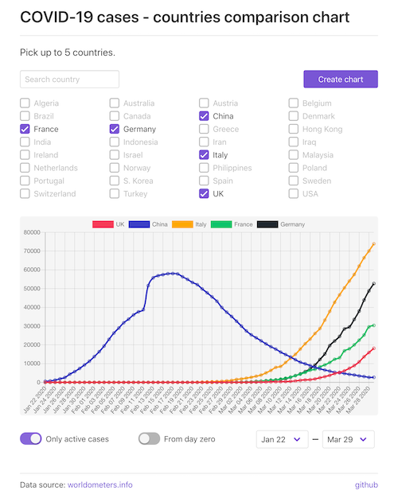

# COVID-19 countries comparison chart

Simple application to compare progress of COVID-19 in selected countries, day by day, on chart. Data is taken from [www.worldometers.info](https://www.worldometers.info/coronavirus/).

## Run app locally

1. Ensure you have node v10+ and npm v6+ installed.
2. Clone this repo.
3. Run `npm ci`.
4. Run `npm start`.
5. Open `localhost:8080` in your browser.

## Stack

Created during short, personal #stayathome hackaton with [express](https://expressjs.com/), [vue](https://vuejs.org/), [webpack](https://webpack.js.org/), [buefy](https://buefy.org/) and [vue-chartjs](vue-chartjs.org) (vue wrapper for [chart.js](https://www.chartjs.org/)).
